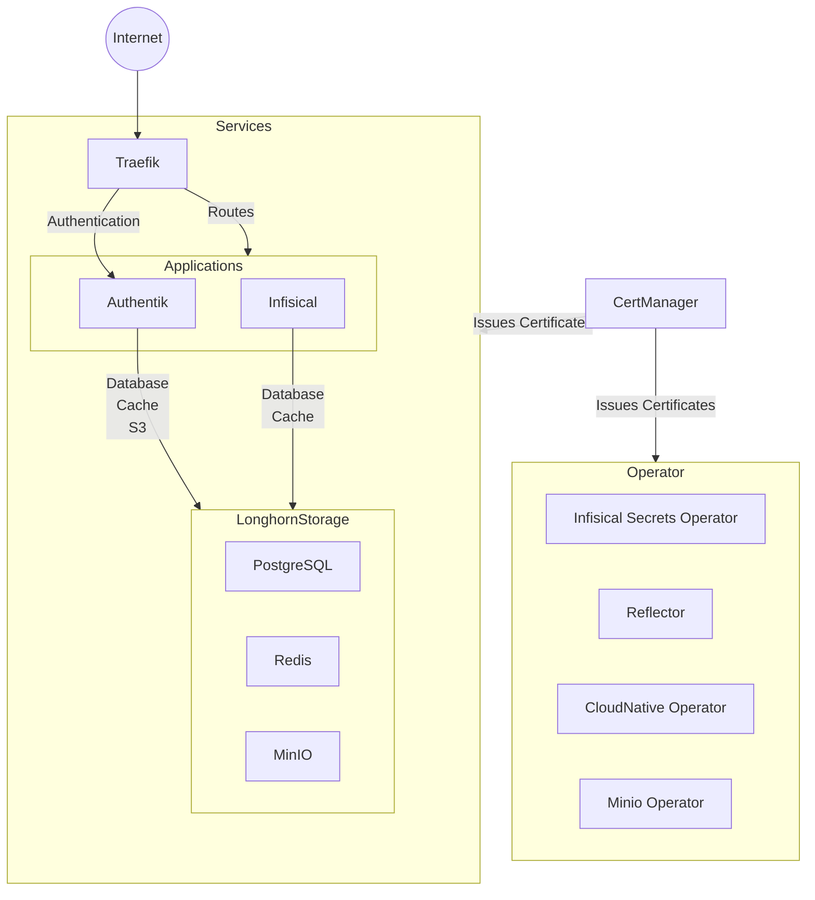

# cluster-config
helm charts, Argo CD applications, and raw manifests for the cluster.

## Kubernetes Cluster Current State Architecture

```mermaid
flowchart TD
    %% External entry point
    Internet((Internet)) --> Traefik

    %% Operator Layer
    subgraph "Operator"
        InfisicalSecretsOperator[Infisical Secrets Operator]
        Reflector
        CloudNativeOperator[CloudNative Operator]
        MinioOperator[Minio Operator]
    end

    CertManager --> |Issues Certificates| Services
    CertManager --> |Issues Certificates| Operator

    subgraph "Services"
        %% Ingress Layer
        Traefik
        Traefik --> |Authentication| Authentik
        Traefik --> |Routes| Applications
        
        %% Application Layer
        subgraph "Applications"
            Authentik
            Infisical
        end

        Infisical --> |Database</br>Cache| LonghornStorage
        Authentik --> |Database</br>Cache</br>S3| LonghornStorage
            
        %% Storage Layer
        subgraph "LonghornStorage"
            PostgreSQL
            Redis
            MinIO
        end
 
    end
```

